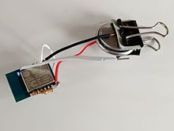
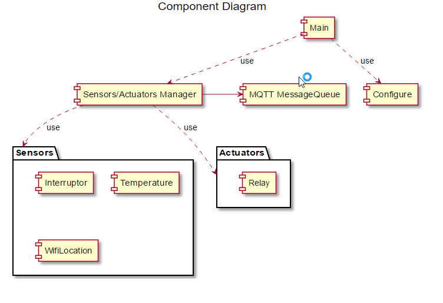
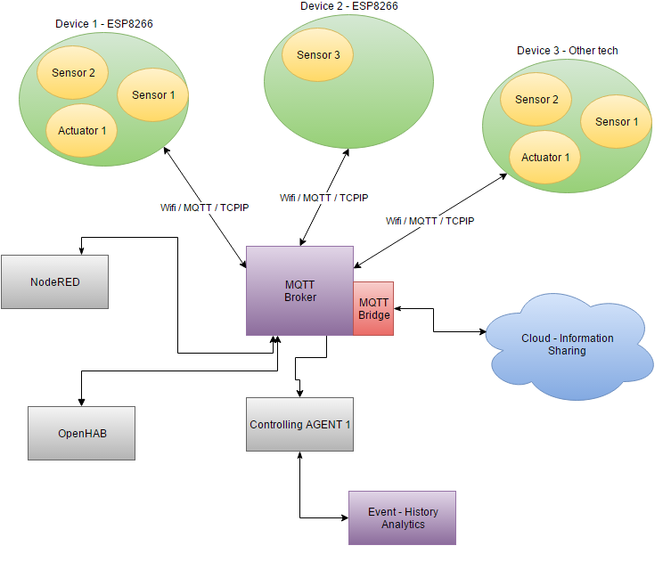

MyNodeIOT
=======

**Build your own HomeMade - Hacked Wifi MQTT devices**

This project permit us to setup NodeMCU units, based on [ESP8266](https://fr.wikipedia.org/wiki/ESP8266) ,  linked to a [MQTT broker](http://mqtt.org/).
We try to give informations about device build with thoses elements.

If you have a bit time and knowledges, for a very cheap cost, you can setup your own home automation, monitoring or "Computer Managed Home Experience"

Quick setup using the lua language of the NodeMCU firmware

We used the principle of **#SmartHome** concepts, you can have more informations here : 
[https://github.com/mqtt-smarthome/mqtt-smarthome](https://github.com/mqtt-smarthome/mqtt-smarthome)

#Project Features

- Simple lua scripts for creating your own IOT [MQTT](http://mqtt.org/) / [ESP8266](https://fr.wikipedia.org/wiki/ESP8266) device
- Extensible objects for creating new sensors or actuators
currently :
	- Switch
	- DHT11 temperature sensor
	- Relays
	- ADC input
	- Body Sensor detector
	- WifiLocation (providing informations on the indoor location of the device)
	- LED matrix display based on WS2812 embedded controller
	- RGB Led strips (PWM controlled)

Components organisation :

---

---

#How this work ?

##The logical view:

The principe is based on the [MQTT](http://mqtt.org/) protocol and Wifi Connection and associated tools.  The [MQTT broker](http://mqtt.org/) collect and distribute the information among the devices, permitting to dissociate sensor, actuators and the usage of them.

**ESP8266** is a quite nice and cheap piece for setting up this solution, for less that 3$ you have an embedded microcontroller for handling the bridge between the software and physical world.

here is the big picture (logical view).

MQTT provide fast and lightweight protocol to make it work.

In a simple implementation, we used a Rasberry PI computer connecter to the ISP box for providing the MQTT broker and private wifi HotSpot.

##The physical view

This is much simple on the physical side, only a RPI, and devices.

Minimum Software Installed :

	RPI : 
		Linux weezy (debian) - RPI
		Mosquitto (MQTT broker)
		NodeRed for handling the logic
		
	a Device using this project : 
		NodeMCU - Firmware
		the current Lua scripts, adjusted on the use

#Software Stuff

Installing Mosquitto on RPI linux : [http://jpmens.net/2013/09/01/installing-mosquitto-on-a-raspberry-pi/](http://jpmens.net/2013/09/01/installing-mosquitto-on-a-raspberry-pi/)

#Hardware Stuff

##Parts we haved used in project

ESP12 - module : [http://www.banggood.com/ESP8266-ESP-12E-Remote-Serial-Port-WIFI-Transceiver-Wireless-Module-p-980984.html](http://www.banggood.com/ESP8266-ESP-12E-Remote-Serial-Port-WIFI-Transceiver-Wireless-Module-p-980984.html)

FTDI - for sending the program to the chip : [http://www.banggood.com/FT232RL-FTDI-USB-To-TTL-Serial-Converter-Adapter-Module-For-Arduino-p-917226.html](http://www.banggood.com/FT232RL-FTDI-USB-To-TTL-Serial-Converter-Adapter-Module-For-Arduino-p-917226.html)

2 Way Relay Module : [http://www.banggood.com/2-Way-Relay-Module-With-Optocoupler-Protection-p-972428.html](http://www.banggood.com/2-Way-Relay-Module-With-Optocoupler-Protection-p-972428.html)

other passif/actif components, 7803 and 7805 for 5v and 3.3v regulator, 
resistors, condensators

##Before starting :

Before starting you can have more informations on NodeMCU firmware here : 
[http://fr.slideshare.net/geekscape/nodemcu-esp8266-workshop-1](http://fr.slideshare.net/geekscape/nodemcu-esp8266-workshop-1)

#Further readings (links)

[http://www.penninkhof.com/2015/05/linking-the-esp8266-a-raspberry-pi-through-mqtt/](http://www.penninkhof.com/2015/05/linking-the-esp8266-a-raspberry-pi-through-mqtt/)

NodeMCU : [http://nodemcu.com/index_en.html](http://nodemcu.com/index_en.html)

NodeMCU Firmware documentation:
[http://nodemcu.readthedocs.io/](http://nodemcu.readthedocs.io/)

An other article on the same subject (french): [http://www.framboise314.fr/linternet-des-objets-iot-sur-raspberry-pi-avec-mqtt/](http://www.framboise314.fr/linternet-des-objets-iot-sur-raspberry-pi-avec-mqtt/)

#Projects made with it

Examples setted up :

[SimpleDevice 01](hardware/SimpleDevice01/index.md)

[SimpleDevice 02](hardware/SimpleDevice02/index.md)

[SimpleDevice 03](hardware/SimpleDevice03/index.md)
